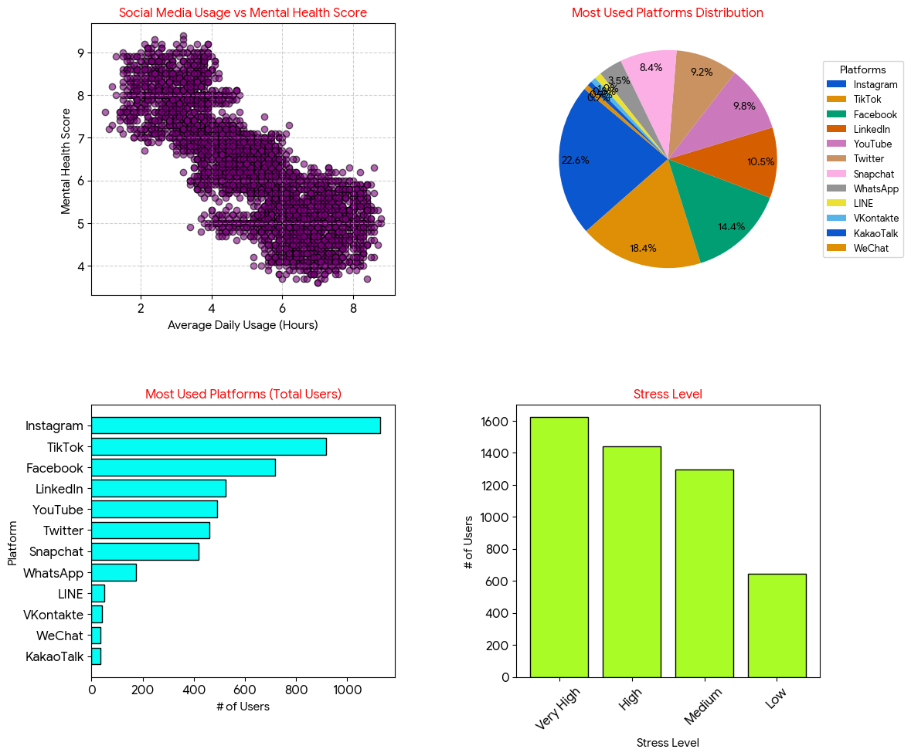

# Student Social Media & Mental Health Analysis

A data analysis project that explores the impact of social media usage on students' mental health and stress levels. This project is my first hands-on application combining the core concepts of **NumPy**, **Pandas**, and **Matplotlib**.

## 📊 Dashboard Preview

## 📊 Project Features
- **Data Cleaning & Manipulation (Pandas):** Dropped irrelevant columns and handled dataset structures.
- **Statistical Analysis (NumPy):** Calculated the average daily social media usage and the standard deviation of sleep hours per night.
- **Data Visualization (Matplotlib):** Designed a custom 2x2 grid dashboard to display correlations between social media hours, mental health scores, platform distribution, and stress levels.

## 🛠️ Technologies Used
- Python 3
- Pandas
- NumPy
- Matplotlib

## 📝 Acknowledgment
I designed the logic, cleaned the data, and created the core components of the visualizations based on my training. I utilized an AI assistant to refine the final layout coordinates (`subplots_adjust`) to prevent overlapping text and keep the charts clean and presentation-ready.
